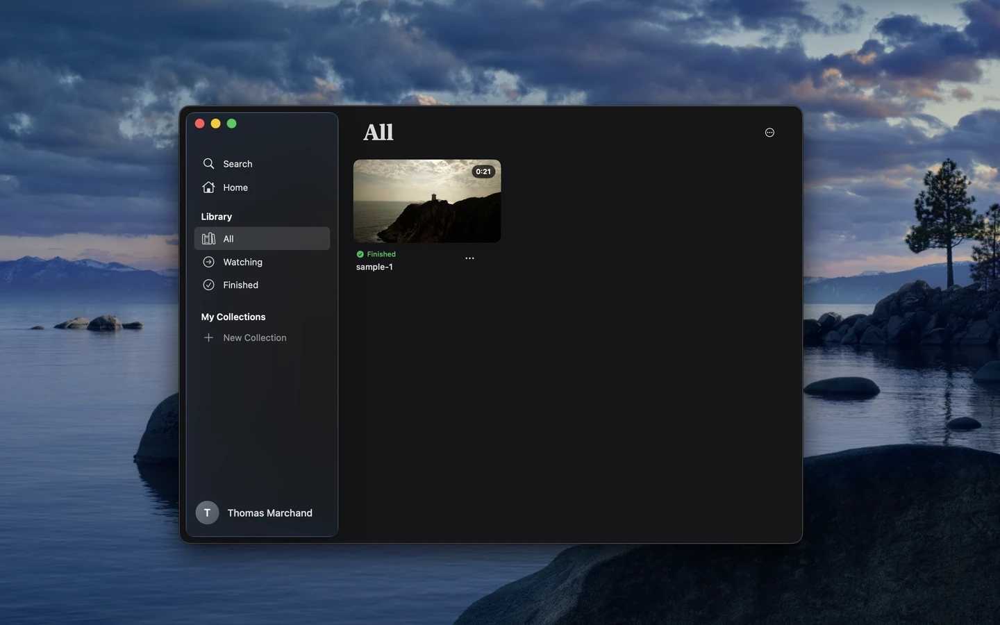
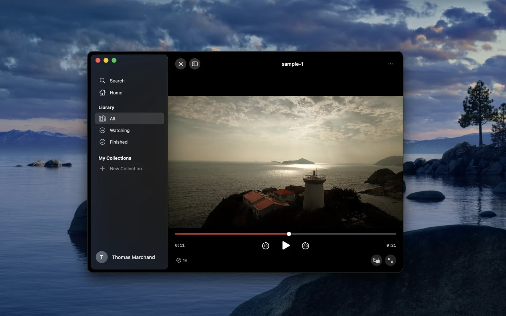
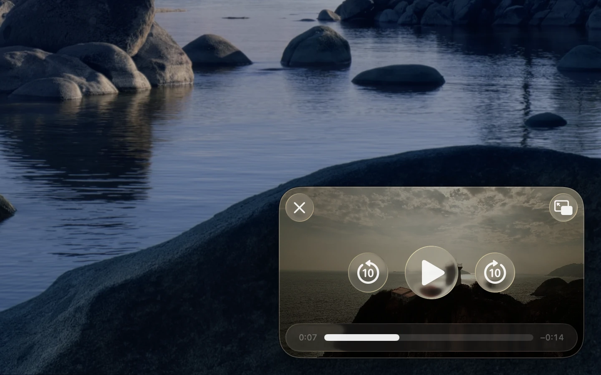
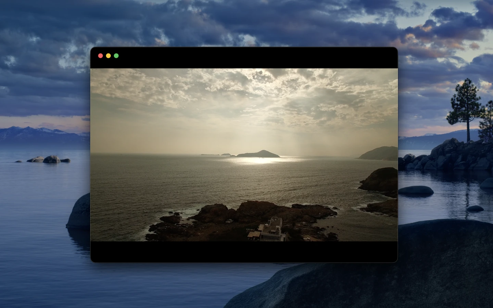

<p align="center">
  
</p>

<h1 align="center">Offline Cinema</h1>

<p align="center">
  <strong>Open source</strong> macOS video library. Beautiful. Minimal. Native.
</p>

<p align="center">
  <a href="#building">Build it yourself</a> · <a href="#features">Features</a>
</p>

---

## What is this?

Offline Cinema is a native macOS application for managing and watching your local video library. Inspired by Apple Books, it provides a clean, minimal interface that feels right at home on macOS.

This project is **fully open source**. You can clone it, build it, modify it, and use it however you like.

- **Drag and drop** videos to build your library
- **Track progress** with automatic resume
- **Organize** with custom collections
- **Full playback** with keyboard controls and Picture-in-Picture

## Screenshots

<p align="center">
  
</p>

<p align="center">
  
</p>

<p align="center">
  
</p>

<p align="center">
  
</p>

## Features

| Feature | Description |
|---------|-------------|
| **Smart Filters** | All, Watching, Finished – automatically organized |
| **Collections** | Create custom collections with icons and colors |
| **Progress Tracking** | Automatically saves your position and watch state |
| **Picture-in-Picture** | Watch in a floating window while you work |
| **Keyboard Shortcuts** | Space, arrows, F for fullscreen |

## Supported Formats

| Video Formats |
|---------------|
| MP4, MOV, MKV, AVI, M4V, WebM, WMV, FLV, 3GP, OGV |

## Requirements

- macOS 14.0+

## Building

### Quick Build

```bash
./build-app.sh
```

This will:
1. Build the app in release mode
2. Create the `OfflineCinema.app` bundle
3. Launch the app automatically

### Clean Rebuild

If you need to rebuild from scratch:

```bash
swift package clean && rm -rf .build OfflineCinema.app && ./build-app.sh
```

### Build with Xcode

Alternatively, open `OfflineCinema.xcodeproj` in Xcode and build from there.

## Running the App

### After Building

The build script automatically launches the app. To run it manually:

```bash
open OfflineCinema.app
```

### Move to Applications (Optional)

```bash
cp -r OfflineCinema.app /Applications/
```

## Keyboard Shortcuts

| Key | Action |
|-----|--------|
| `Space` | Play / Pause |
| `←` | Skip back 10s |
| `→` | Skip forward 30s |
| `↑` / `↓` | Volume |
| `F` | Fullscreen |
| `Esc` | Exit player |
| `⌘O` | Import video |

## Project Structure

```
offline_cinema/
├── OfflineCinema/
│   ├── Models/           # Video, Collection, WatchProgress
│   ├── Services/         # VideoLibrary, Persistence, Thumbnails
│   ├── Views/            # SwiftUI views
│   └── Assets.xcassets/  # App icons and colors
├── build-app.sh          # Build script
└── Package.swift         # Swift Package Manager config
```

## Data Storage

Your library data is stored in:
```
~/Library/Application Support/OfflineCinema/
```

Videos are not copied – only references (bookmarks) are stored.
